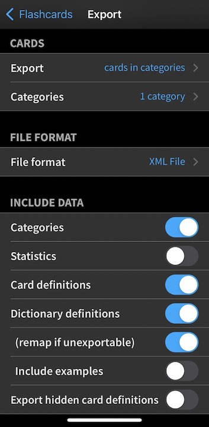

# Pleco Anki

A plug-in for [Anki](https://apps.ankiweb.net/) that aids in the Mandarin learning workflow by simplifying the process of importing flashcards from the Chinese dictionary app [Pleco](https://www.pleco.com/).

Currently Custom Definition flashcards from Pleco are support, but support for Dictionary-based cards is soon to follow.

## Exporting from Pleco

Apply the following settings when exporting from Pleco. Currently only Simplified character sets are supported.

## In the works
- Support for dictionary-based flashcards
- Generating AI Mandarin audio to match the headwords
- Support for `.txt` file exports
- Support for Traditional character sets
